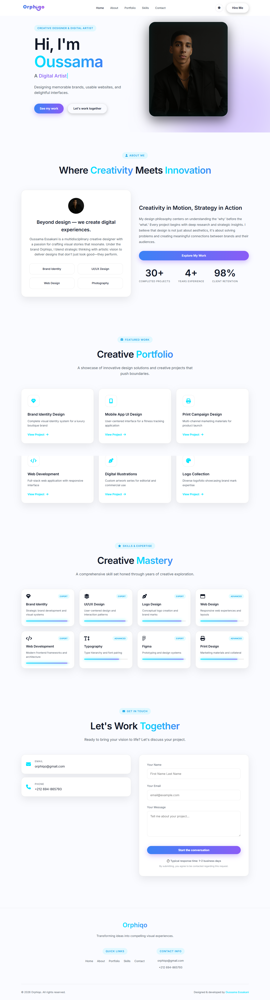
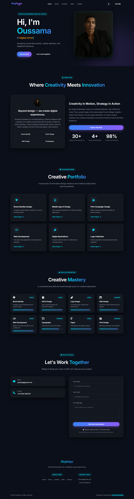
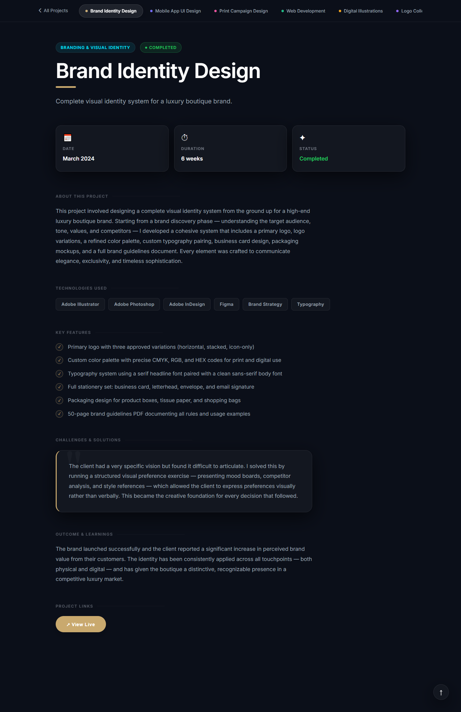
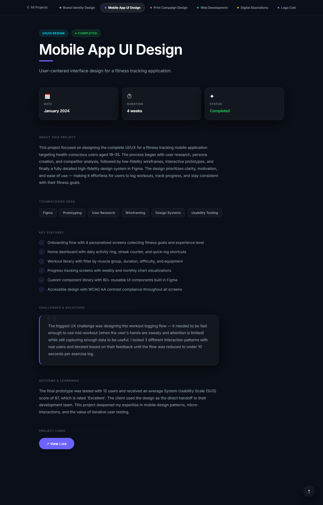
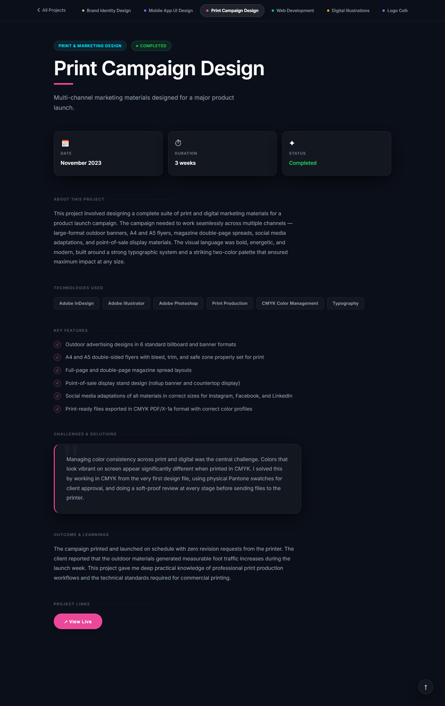
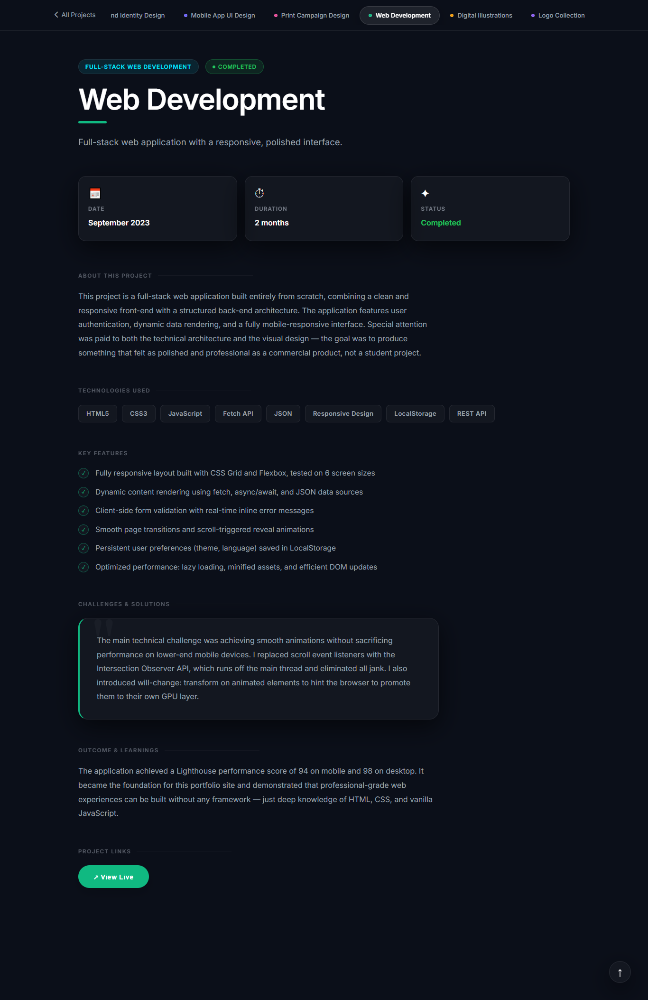
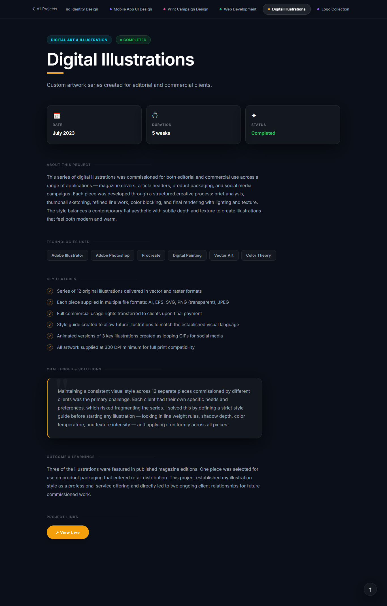
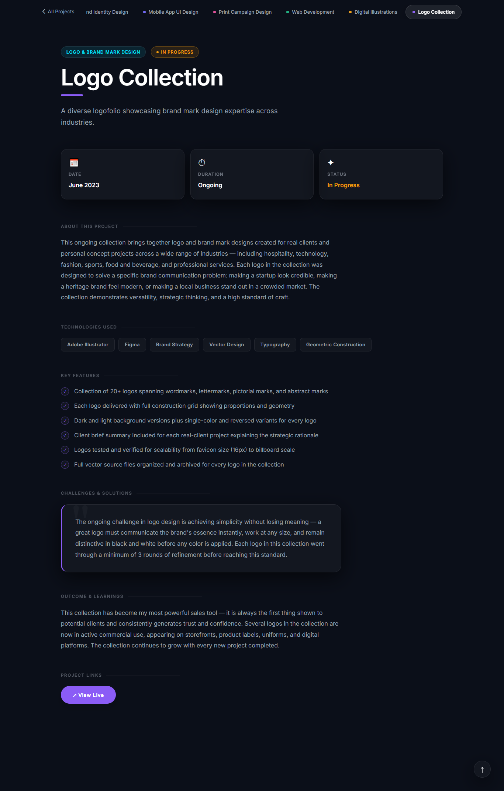

# 🎨 Orphiqo | Graphic Designer, Web Developer & Brand Designer

Welcome to the official portfolio of **Oussama Essakani**, known professionally as **Orphiqo**. This repository contains the **Vanilla Web Implementation** (HTML, CSS, JS) of the project.

> [!NOTE]
> This is the pure HTML/CSS/JS version of the Orphiqo portfolio. A high-performance **Next.js & React** version also exists, which can be found here: [View Next.js Version](http://orphiqo.vercel.app/)

---

## ✨ Project Overview

**Orphiqo** is more than just a portfolio; it's a showcase of where creativity meets innovation. Built with a focus on high-end aesthetics, smooth animations, and a "mobile-first" responsive philosophy, this website provides a cinematic journey through various creative projects.

### 🎭 The Case Study Experience
At the heart of this portfolio lies an immersive **Case Study Engine**. Each project is presented not just as a static image, but as a deep-dive journey through the creative process. Utilizing a sophisticated, JSON-driven architecture, the project details page offers:
- **Immersive Storytelling**: A narrative-driven breakdown of challenges, solutions, and technical outcomes.
- **Glassmorphic Navigation**: A seamless, high-performance tab system that lets you transition between projects with zero friction.
- **Dynamic Interaction**: Hover-aware tags, pulsing status indicators, and glassmorphic cards that respond to user intent.
- **Coming Soon Previews**: A professional modal system to manage expectations for live project walkthroughs that are currently under wraps.

---

## 🚀 Key Features

- **Futuristic UI/UX**: A dark-mode-first aesthetic with neon accents, glassmorphism, and subtle grain overlays.
- **Dynamic Case Studies**: A professional project details system that fetches data dynamically from a JSON source.
- **Glassmorphic Navigation**: A high-end project tab system featuring backdrop-blur effects and professional transitions.
- **Live Preview Modal**: An elegant "Coming Soon" modal for live project links, maintaining a professional user experience.
- **Intersection Observer Reveal**: Smooth "scroll-to-reveal" animations for every section.
- **Dual Theme Support**: Seamless switching between Dark Mode and Light Mode, synchronized across all pages.
- **Fully Responsive**: Perfectly optimized for Desktop, Tablet, and Mobile devices.
- **Interactive Mobile Menu**: A premium, full-screen navigation overlay with staggered entrance animations.

---

## 📱 Premium Responsive Design

One of the highlights of this project is its flawless responsiveness. Unlike standard portfolio templates, Orphiqo features:

- **Custom Hero Reordering**: On mobile/tablet, elements are intelligently re-ordered (Headline → Typing → Image → Slogan → CTAs) to maintain visual hierarchy and engagement.
- **Tabbed Case Studies**: The project details page utilizes a "one-at-a-time" tabbed view on mobile, ensuring no vertical clutter and an app-like feel.
- **Fluid Typography**: Headlines and body text scale dynamically to ensure readability on any screen size.
- **Touch-Optimized**: Stacking buttons and cards provide large, accessible tap targets for mobile users.

---

## 🛠️ Built With

- **HTML5**: Semantic structure for SEO and accessibility.
- **CSS3 (Vanilla)**: Custom styling including Flexbox, Grid, and CSS Variables for theme management.
- **JavaScript (Vanilla)**: Lightweight logic for dynamic data fetching, tab management, and modal interactions.
- **JSON**: Structured data management for portfolio projects, enabling easy updates without code changes.
- **Font Awesome**: Premium iconography for a professional look.
- **Google Fonts**: Utilizing 'Inter' and 'Playfair Display' for high-end typography.

---

## 🎨 Design Philosophy

> "Beyond design — we create digital experiences."

The design focuses on **Visual Excellence**. Every pixel is placed with intent, using curated color palettes, smooth gradients, and micro-animations to create a feeling of luxury and professionalism.

---

## 📂 Project Structure

The project follows a clean, professional directory structure for better maintainability:

```text
├── css/                  # All stylesheets
│   ├── style.css         # Main portfolio styles
│   └── project-details.css # Case study specific styles
├── js/                   # Core logic and scripts
│   ├── script.js         # Global interactions and theme logic
│   └── project-details.js # Project fetching and tab management
├── data/                 # Data sources
│   └── projects.json     # Structured portfolio data
├── images/               # High-quality visual assets
├── index.html            # Main entrance (Landing page)
├── project-details.html  # Dynamic project showcase page
└── README.md             # Project documentation
```

---

## 📸 Screenshots & Previews

Explore the visual excellence of Orphiqo through these curated previews. Click on a title to reveal the screenshot.

### 🌓 Global Themes

<details>
<summary><b>Light Mode Preview (Click to expand)</b></summary>
<br>

</details>

<details>
<summary><b>Dark Mode Preview (Click to expand)</b></summary>
<br>

</details>

### 🎭 Case Study Previews

<details>
<summary><b>Brand Identity Design</b></summary>
<br>

</details>

<details>
<summary><b>Mobile App UI Design</b></summary>
<br>

</details>

<details>
<summary><b>Print Campaign Design</b></summary>
<br>

</details>

<details>
<summary><b>Web Development</b></summary>
<br>

</details>

<details>
<summary><b>Digital Illustrations</b></summary>
<br>

</details>

<details>
<summary><b>Logo Collection</b></summary>
<br>

</details>

---

## 👨‍💻 Author

**Oussama Essakani (Orphiqo)**
- **Roles**: Graphic Designer | Web Developer | Web Designer | Brand Identity Designer
- **Portfolio**: [GitHub Pages](https://oussamaessakani1.github.io/portfolio_essakani_oussama/)
- **Contact**: orphiqo@gmail.com

---

© 2026 Orphiqo. All rights reserved.
